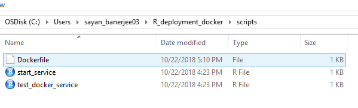
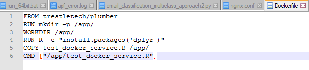
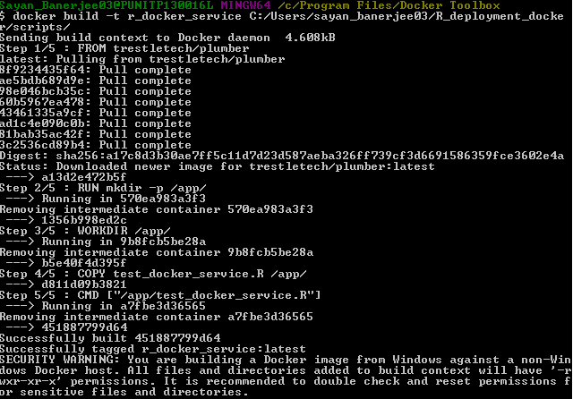
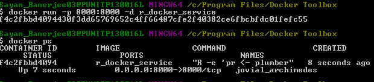
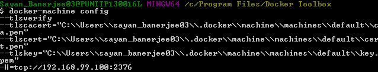
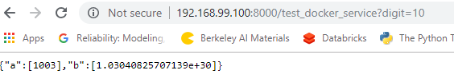

This is part 1 and this describes how to deploy single instance of a R service on docer

## Example R service code:
 
 
 

## Folder structure:   
No need to have the start service file. Only following required:
1.	prediction code with plumber
2.	Model rda files and any other reference files
3.	Dockerfile
 

 
## Dockerfile: 
In our case we'll need to have additional copy statements for rda files and all other reference files.
Note the command to install required R packages. All required R packages are need to be installed explicitly (not plumber)
 

 
 
## Build docker image:
Note how folder structure is provided in the build command (here Dockerfile should reside)
This will also install all the required R packages (as per Dockerfile) at the end (may take some time)

 
## Docker image repository: 
See plumber image is now downloaded as well
 

 
## Run new docker image and see it is running
 

 
## To know docker machine IP:

 
## Invoke the Service: 
Use Ip address from above and port form docker run command

