# LOAD BALANCING using NGINX:

The following steps provide instructions on how to load balance R services on docker and how to organise + start them using docker-compose.

Reference Artefacts:

- https://www.rplumber.io/docs/hosting.html
- https://docs.docker.com/compose/compose-file/
- https://docs.nginx.com/nginx/admin-guide/load-balancer/http-load-balancer/

## Example R service code:

There is no change in R service code from part 1.

## Folder structure: 

The root directory will have following
1. The folder for R scripts and corresponding DockerFile 
2. The folder containing NGINX related config and Dcoker file
3. The docker-compose.yml file

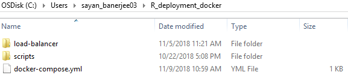

## Contents of scripts folder:

No change from part 1

## Contents of load-balancer folder:

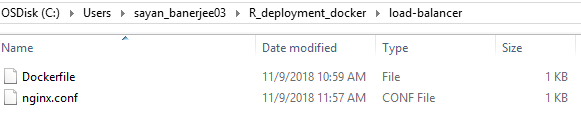

## docker-compose.yml file:

It creates 3 instances (backend1, backend2 and backend3) for the same R service. It builds these 3 instances by executing Dockerfile in scripts folder.

Note that internally each service is exposed at port 8000 but externally exposed at 8010, 8020 and 8030. So post deployment these 3 instances will be available on those ports individually.

The load-balancer section links 3 backend services and listens to 8080 port. It builds the nginx load-balander by executing Dockerfile in load-balancer folder.

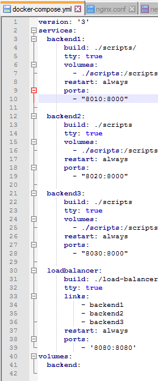

## R service Dockerfile:

No change from part 1.

## nginx.conf file:

This has 2 main parts as follow:
- Upstream section: this is named as backend on line 14. The block contains reference to backend1, backend2 and backend3 as defined in docker-compose.yml. NOTE the port numbers here. This does NOT refer to 8010, 8020 and 8030. Instead refer to 8000 for all as that is the port number where the services are exposed internally.
- Server section: the listen command should have the same port number as load-balancer section in docker-compose file. The location block indicates where to forward the HTTP requests. In this is case to "backend" as defined in upstream.

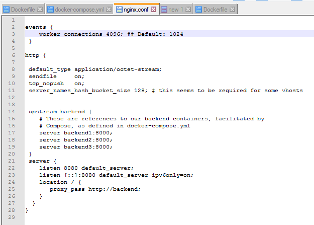

## NGINX Dockerfile:

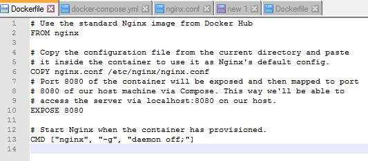

## Docker-compose build:

1. Go the folder where docker-compose.yml is present
2. Run docker-compose up --build (this will need to have internet access for the first time as all images will be download and R libraries as well.)

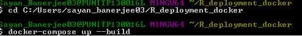

Once build is complete, you will see a screen like this. However it will not return the prompt and you will http requests on this screen when services are invoked.

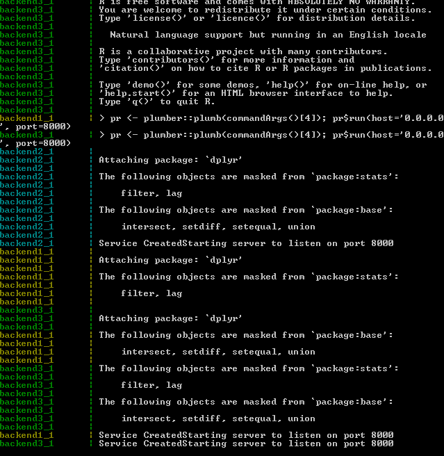

## Invoking the service:

First we can test whether individual services are running.

### Backend1 - 

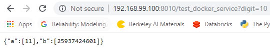

Corresponding http request at Backend1 - 

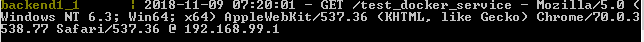

### Backend2 - 

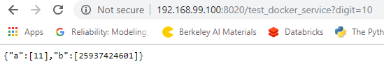

Corresponding http request at Backend2 - 

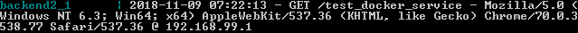

### Backend3 - 

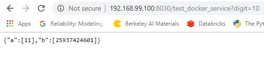

Corresponding http request at Backend3 - 

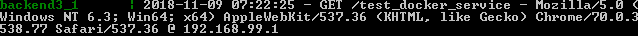

Now on load balancer:

### First hit:

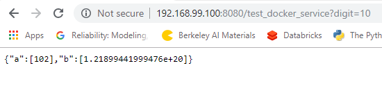

Corresponding backend - this time it hit backend1:

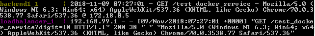

### Second hit:

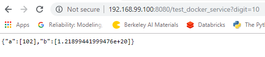

Corresponding backend - this time it hit backend2:

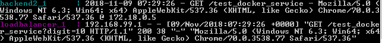

### Third hit:

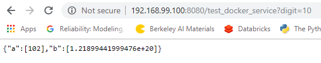

Corresponding backend - this time it hit backend3:

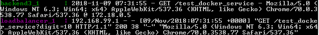

So the load balancer is using round robin scheme for load balancing. These schemes can be changed. See the nginx documentation in reference artefacts.
